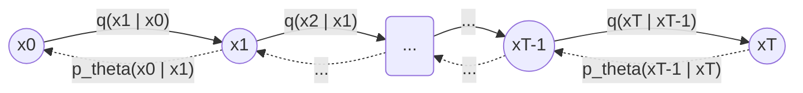

# Diffusion Model 学习笔记

## Diffusion 过程

要理解diffusion，先把输入放到一边，先尝试解决第一个问题：如何让模型在没有额外输入（文本，图像）的情况下，通过diffusion过程生成一个跟训练集图片风格一致的图片

黑色实线（→）是 forward process（加噪声，固定，无参数）；虚线（-.→）是 reverse process（去噪声，网络 εθ 预测）。

### Forward process

用大白话来说，forward process就是给一个原始图片 $x_0$ 不断加噪声，直至得到一个完全模糊的图像 $x_T$ 为止。

单步加噪（马尔可夫链，每步只依赖上一步）：

$$
q(x_t \mid x_{t-1}) = \mathcal{N}\left(x_t; \sqrt{1-\beta_t}\, x_{t-1},\ \beta_t I\right)
$$

其中 $\beta_t \in (0,1)$ 是第 $t$ 步的噪声强度（noise schedule）。

任意步的闭式解（可以从 $x_0$ 直接跳到 $x_t$，不用逐步采样）：

$$
q(x_t \mid x_0) = \mathcal{N}\left(x_t; \sqrt{\bar\alpha_t}\, x_0,\ (1-\bar\alpha_t) I\right)
$$

其中 $\alpha_t = 1-\beta_t$，$\bar\alpha_t = \prod_{s=1}^{t} \alpha_s$。

### 换个角度理解：重参数化（reparameterization）

$q(x_t \mid x_{t-1})$ 是一个正态分布，等价于说：先从标准正态采样一个噪声 $\epsilon$，再做一次线性变换：

$$
x_t = \sqrt{\alpha_t}\, x_{t-1} + \sqrt{1-\alpha_t}\, \epsilon, \qquad \epsilon \sim \mathcal{N}(0, I)
$$

（这里 $\alpha_t = 1-\beta_t$。）这就是"重参数化技巧"：把"从分布里采样"改写成"采样一个固定分布的噪声 + 确定性变换"，好处是整个过程对参数可导，也更直观——每一步就是把上一步的图像缩小一点、再叠加一点噪声。

同理，闭式解 $q(x_t \mid x_0)$ 也可以写成同样的形式：

$$
x_t = \sqrt{\bar\alpha_t}\, x_0 + \sqrt{1-\bar\alpha_t}\, \epsilon, \qquad \epsilon \sim \mathcal{N}(0, I)
$$

### 练习题：证明为什么可以从 $x_0$ 直接跳到 $x_t$

**题目**：已知单步加噪 $x_t = \sqrt{\alpha_t}\, x_{t-1} + \sqrt{1-\alpha_t}\, \epsilon_t$（各步的 $\epsilon_t$ 互相独立，均服从 $\mathcal{N}(0,I)$），证明

$$
x_t = \sqrt{\bar\alpha_t}\, x_0 + \sqrt{1-\bar\alpha_t}\, \epsilon, \qquad \epsilon \sim \mathcal{N}(0, I),\quad \bar\alpha_t = \prod_{s=1}^t \alpha_s
$$

**提示**：用数学归纳法，核心是"两个独立高斯变量的线性组合仍是高斯变量"这一性质：若 $\epsilon_1, \epsilon_2 \sim \mathcal{N}(0,I)$ 独立，则 $a\epsilon_1 + b\epsilon_2 \sim \mathcal{N}(0, (a^2+b^2)I)$，可以合并成一个新的 $\epsilon \sim \mathcal{N}(0,I)$ 乘以系数 $\sqrt{a^2+b^2}$。

**证明**：

- 归纳基础（$t=1$）：$x_1 = \sqrt{\alpha_1}\,x_0 + \sqrt{1-\alpha_1}\,\epsilon_1$，此时 $\bar\alpha_1 = \alpha_1$，结论成立。
- 归纳假设：设 $x_{t-1} = \sqrt{\bar\alpha_{t-1}}\, x_0 + \sqrt{1-\bar\alpha_{t-1}}\, \bar\epsilon_{t-1}$，其中 $\bar\epsilon_{t-1} \sim \mathcal{N}(0,I)$。
- 归纳步骤：把它代入单步公式

$$
\begin{aligned}
x_t &= \sqrt{\alpha_t}\, x_{t-1} + \sqrt{1-\alpha_t}\, \epsilon_t \\
&= \sqrt{\alpha_t}\left(\sqrt{\bar\alpha_{t-1}}\, x_0 + \sqrt{1-\bar\alpha_{t-1}}\, \bar\epsilon_{t-1}\right) + \sqrt{1-\alpha_t}\, \epsilon_t \\
&= \sqrt{\alpha_t \bar\alpha_{t-1}}\, x_0 + \underbrace{\sqrt{\alpha_t(1-\bar\alpha_{t-1})}\, \bar\epsilon_{t-1} + \sqrt{1-\alpha_t}\, \epsilon_t}_{\text{两个独立高斯的线性组合}}
\end{aligned}
$$

由于 $\bar\epsilon_{t-1}$ 与 $\epsilon_t$ 相互独立，二者的线性组合仍是高斯分布，方差为两系数平方和：

$$
\alpha_t(1-\bar\alpha_{t-1}) + (1-\alpha_t) = \alpha_t - \alpha_t\bar\alpha_{t-1} + 1 - \alpha_t = 1 - \alpha_t\bar\alpha_{t-1} = 1-\bar\alpha_t
$$

所以可以把这两项合并成一个新的 $\epsilon \sim \mathcal{N}(0,I)$：

$$
x_t = \sqrt{\alpha_t\bar\alpha_{t-1}}\, x_0 + \sqrt{1-\bar\alpha_t}\, \epsilon = \sqrt{\bar\alpha_t}\, x_0 + \sqrt{1-\bar\alpha_t}\, \epsilon
$$

（用到 $\bar\alpha_t = \alpha_t \bar\alpha_{t-1}$）。由归纳法，结论对所有 $t$ 成立。∎

**直觉**：每一步加噪都是"独立"的高斯噪声，多步叠加后依然是高斯分布（高斯分布对线性组合封闭），所以可以把 $t$ 步噪声"预先合并"成一个等效的单步噪声，直接从 $x_0$ 采样到 $x_t$，不需要真的跑 $t$ 次循环。

### Reverse Process

Reverse Process是比较难理解的过程。但是直觉上容易理解：如何找到最优参数 $p_\theta$，能以最大概率还原 $x_0$，即

$$
p_\theta(x_{t-1} \mid x_t), \qquad \theta^* = \arg\max_{\theta} \log p_\theta(x_0)
$$

#### 概率论基础（复习）

联合概率分布 $p_{X,Y}(x,y)$，对事件 $B$：

$$
P_{X,Y}(B) = \sum_{(x,y) \in B} p_{X,Y}(x,y) \qquad \text{（离散）}
$$

$$
P_{X,Y}(B) = \iint_{(x,y) \in B} p_{X,Y}(x,y)\, dx\, dy \qquad \text{（连续）}
$$

若 $X$ 与 $Y$ 独立：

$$
p(x \mid y) = p(x) \iff p(y \mid x) = p(y)
$$

边际概率分布是联合分布的特殊推论，已知 $p_{X,Y}$，求 $p_X(x)$：

$$
p_X(x) = \sum_{y} p_{X,Y}(x,y) \qquad \text{（离散）}
$$

$$
p_X(x) = \int p_{X,Y}(x,y)\, dy \qquad \text{（连续）}
$$

#### Reverse process

Reverse process的工作，就是找到一组 $p_\theta$ 参数来让 $p(x_0)$ 的概率最大

$$
p(x_0, x_1, x_2, \ldots, x_t) = p(x_0, x_{1:t}) = p(x_0)\, p(x_1 \mid x_0)\, p(x_2 \mid x_1) \cdots p(x_{t-1} \mid x_t)
$$

$$
p(x_0) = \int p(x_0, x_{1:T})\, dx_{1:T}
$$

很不幸，上式的积分是不可解析计算的（intractable）。

#### 一系列神奇的数学变换

这个部分太耗时间，而且有点过于烧脑，此处先跳过, 大致思路是通过一个数学变换，把上述公式转换为一个数学期望，然后apply Jensen's inequality，得到一个下界（ELBO），然后再通过变分推断（variational inference）来优化这个下界。

#### Loss function

跳过 ELBO 推导细节，DDPM 最终使用的训练目标是一个非常简洁的均方误差（"simple loss"）：

$$
L_{\text{simple}}(\theta) = \mathbb{E}_{t,\, x_0,\, \epsilon}\Big[\ \|\epsilon - \epsilon_\theta(x_t, t)\|^2\ \Big], \qquad x_t = \sqrt{\bar\alpha_t}\, x_0 + \sqrt{1-\bar\alpha_t}\, \epsilon
$$

各参数含义：

- $\theta$：神经网络的可训练权重。
- $t$：时间步，训练时从 $1$ 到 $T$ 中随机抽一个。
- $x_0$：训练集里随机抽的一张真实图片。
- $\epsilon$：随机现场采样的高斯噪声，$\epsilon \sim \mathcal{N}(0, I)$，是模型要去猜的"标准答案"。
- $\bar\alpha_t$：由 noise schedule 事先算好的常数，只跟 $t$ 有关，不是学出来的。
- $x_t$：把 $x_0$ 和 $\epsilon$ 按 $\bar\alpha_t$ 的比例混合算出来的"加噪后的图"。
- $\epsilon_\theta(x_t, t)$：神经网络的输出，输入加噪图 $x_t$ 和时间步 $t$，输出网络猜的噪声。
- $\|\cdot\|^2$：平方 L2 范数，即均方误差（MSE）。

训练流程：随机挑一张图、随机挑一个时间步、随机撒一把噪声混合出 $x_t$；网络看到 $x_t$ 和 $t$，猜出撒了什么噪声；猜的噪声和真实噪声的均方误差就是 loss，反向传播更新 $\theta$。

#### Reverse process 采样公式

真实后验 $q(x_{t-1}\mid x_t, x_0)$ 是高斯分布，均值和方差：

$$
\tilde\mu_t(x_t,x_0) = \frac{\sqrt{\bar\alpha_{t-1}}\,\beta_t}{1-\bar\alpha_t}\, x_0 + \frac{\sqrt{\alpha_t}\,(1-\bar\alpha_{t-1})}{1-\bar\alpha_t}\, x_t, \qquad \tilde\beta_t = \frac{1-\bar\alpha_{t-1}}{1-\bar\alpha_t}\,\beta_t
$$

推理时没有 $x_0$，用重参数化公式反解出的估计值代入：

$$
\hat{x}_0 = \frac{1}{\sqrt{\bar\alpha_t}}\left(x_t - \sqrt{1-\bar\alpha_t}\,\epsilon_\theta(x_t,t)\right)
$$

代入化简后，模型的均值参数化为：

$$
\mu_\theta(x_t, t) = \frac{1}{\sqrt{\alpha_t}}\left(x_t - \frac{\beta_t}{\sqrt{1-\bar\alpha_t}}\, \epsilon_\theta(x_t, t)\right)
$$

每一步采样公式（从 $x_T \sim \mathcal{N}(0,I)$ 开始，$t=T,\ldots,1$ 迭代到 $x_0$）：

$$
x_{t-1} = \frac{1}{\sqrt{\alpha_t}}\left(x_t - \frac{\beta_t}{\sqrt{1-\bar\alpha_t}}\, \epsilon_\theta(x_t, t)\right) + \sigma_t z, \qquad z \sim \mathcal{N}(0,I)\ (t>1\text{ 时加噪声，}t=1\text{ 时不加}),\quad \sigma_t^2 = \beta_t \text{ 或 } \tilde\beta_t
$$

## Training and Sampling Algorithm

DDPM 训练算法。Reference: Hung-yi Lee ML 2023 course, https://speech.ee.ntu.edu.tw/~hylee/ml/ml2023-course-data/DDPM%20(v7).pdf

DDPM 采样算法。Reference: Hung-yi Lee ML 2023 course, https://speech.ee.ntu.edu.tw/~hylee/ml/ml2023-course-data/DDPM%20(v7).pdf

## U-Net

TODO

